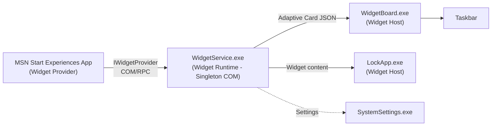
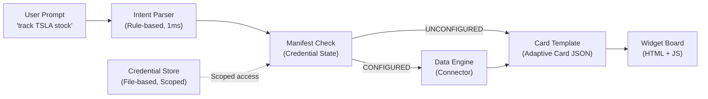
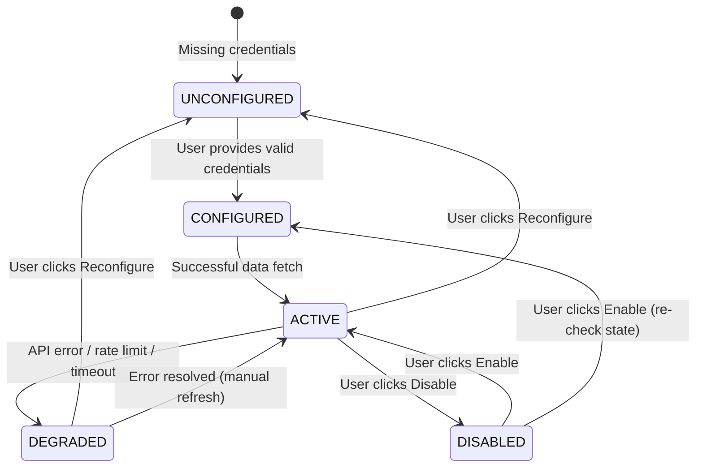

# Widget Forge — Hackathon Pitch Document

## One-Liner

**Widget Forge turns a natural language prompt into a live, self-configuring widget — eliminating the developer bottleneck that currently gates every new widget on the Windows Widget Board.**

---

## Table of Contents

- [Problem Statement](#problem-statement)
- [Solution Overview](#solution-overview)
- [Architecture: Current vs Widget Forge](#architecture-current-vs-widget-forge)
- [Pain Points & What We Solved](#pain-points--what-we-solved)
- [Key Features Demonstrated](#key-features-demonstrated)
- [Hackathon Category Fit](#hackathon-category-fit)
- [Enterprise & Cloud Deployment Path](#enterprise--cloud-deployment-path)
- [Future Roadmap](#future-roadmap)
- [What We're NOT Claiming](#what-were-not-claiming)
- [Demo Script](#demo-script)

---

## Problem Statement

The Windows Widget Board is powered by the **Widget Developer Platform (WDP)** — a COM-based runtime (`WidgetService.exe`) that brokers communication between **Widget Hosts** (Widget Board, Lock Screen) and **Widget Providers** (apps that supply content).

### The Current Widget Creation Pipeline

```
Developer writes C++/C# code
    → Implements IWidgetProvider (6 COM methods)
    → Registers COM server
    → Declares widgets in AppxManifest (AppExtension)
    → Packages as MSIX
    → Submits to Microsoft Store
    → User installs app
    → Widget appears in Widget Picker
    → User manually adds widget
```

**Time from idea to widget: Weeks to months.**

### What's Missing

1. **No AI layer** — Widget Picker is browse-only. User must know what widget they want before finding it.
2. **No credential lifecycle** — `IWidgetProvider` has no methods for credential management. Each provider handles auth independently.
3. **No failure transparency** — if a widget's API key expires, it goes blank. No explanation, no recovery path.
4. **No self-service for enterprise** — IT admins can't create internal widgets (ADO, Plane.so, ServiceNow) without building full Win32/UWP apps.
5. **No rapid prototyping** — each iteration requires build → package → install → test.

---

## Solution Overview

Widget Forge is a **local-first, prompt-driven widget platform** that demonstrates capabilities missing from the current Widget Board architecture.

### The Widget Forge Pipeline

```
User types: "track TSLA stock"
    → Intent parser extracts: data_source=stock, entity=TSLA (1ms, no LLM)
    → Platform checks credential state from manifest
    → If UNCONFIGURED → renders setup card (explains what's needed + where to get it)
    → If CONFIGURED → fetches live data via connector
    → Generates Adaptive Card JSON (same format as real Widget Board)
    → Renders on board with auto-refresh, state badges, lifecycle management
```

**Time from idea to widget: 2 seconds.**

### Core Architecture

```
┌─────────────────────────────────────────────────────────┐
│                    Widget Forge                          │
│                                                          │
│  ┌──────────┐   ┌───────────┐   ┌──────────────────┐   │
│  │ Frontend  │   │  FastAPI   │   │  Widget Manifest │   │
│  │ (Board UI)│◄─►│  Backend   │◄─►│  Registry        │   │
│  │           │   │           │   │  (12 built-in +   │   │
│  │ - Render  │   │ - Forge   │   │   dynamic plugins)│   │
│  │ - Refresh │   │ - Refresh │   │                    │   │
│  │ - Setup   │   │ - Creds   │   │  ┌──────────────┐ │   │
│  │ - Toggle  │   │ - Toggle  │   │  │ Credential   │ │   │
│  │ - Resize  │   │ - Actions │   │  │ Store (scoped│ │   │
│  └──────────┘   └─────┬─────┘   │  │ per widget)  │ │   │
│                       │          │  └──────────────┘ │   │
│                       ▼          └──────────────────┘   │
│              ┌──────────────┐                            │
│              │ Data Engine   │                            │
│              │ (Connectors)  │                            │
│              │               │                            │
│              │ GitHub, ADO,  │                            │
│              │ News, Weather,│                            │
│              │ Stock, Plane, │                            │
│              │ System, etc.  │                            │
│              └──────────────┘                            │
└─────────────────────────────────────────────────────────┘
```

---

## Architecture: Current vs Widget Forge

### Current Windows Widget Architecture



**Communication flow:** Provider App → COM/RPC → WidgetService.exe → Host App → UI

### Widget Forge Architecture



### Component Mapping

| Windows Widget Platform | Widget Forge | Notes |
|---|---|---|
| Widget Host (WidgetBoard.exe) | Frontend (`app.js` + board UI) | Both render Adaptive Card JSON |
| Widget Runtime (WidgetService.exe) | Backend (FastAPI router + data engine) | Both broker between providers and host |
| Widget Provider (MSN, 3rd party apps) | Connectors (`news.py`, `github.py`, etc.) | Both fetch data and return structured content |
| AppxManifest AppExtension | `manifest.json` in `widget_plugins/` | Both declare widget metadata and capabilities |
| Widget Catalog | `WIDGET_MANIFESTS` registry | Both enumerate available widget types |
| IWidgetProvider contract | Connector functions (`get_issues()`, `get_news()`) | Both define the data fetch interface |
| Adaptive Card JSON output | `card_templates.py` output | **Identical format** — directly compatible |
| COM activation at startup | Plugin discovery at startup (`discover_plugins()`) | Both scan for new widgets on launch |
| Proxy retry logic | Frontend `_refreshState` with in-flight guard | Both handle concurrent request management |
| Widget Picker (browse catalog) | Suggestions popup + prompt bar | Forge adds natural language on top |

---

## Pain Points & What We Solved

| # | Current Architecture Pain Point | Evidence from Codebase | Impact | What Widget Forge Solves |
|---|---|---|---|---|
| 1 | **Adding a widget requires a packaged app** — AppxManifest, COM server registration, Store submission, MSIX packaging | Every widget provider must implement `IWidgetProvider`, register via `com.microsoft.windows.widgets` AppExtension, declare in AppxManifest, and ship through Store | **Weeks-to-months** from idea to widget on user's board. Developer must know COM, C++/C#, MSIX packaging, and Store submission process | **Manifest-only onboarding** — drop a `manifest.json` in `widget_plugins/` folder, restart, done. No COM server, no packaging, no Store. A new widget type goes from idea to board in **minutes** |
| 2 | **No self-service for enterprise users** — IT admins can't create internal widgets without building a full Win32/UWP app | Provider must be a packaged desktop app or Edge PWA with COM activation. Internal tools (ADO boards, Plane.so, ServiceNow) require dedicated dev investment to become widget providers | Enterprise dashboards are impossible without dedicated dev teams building full provider apps. Internal API widgets simply don't exist on the Widget Board today | **Plugin manifest system** — IT admin writes a `manifest.json` declaring API key requirements + setup steps. Platform handles credential collection, lifecycle, and rendering. No code required. Works for Plane.so, ADO, any internal REST API |
| 3 | **Widget content is static per provider** — MSN provides a fixed set (Sports, Watchlist, Daily Wonder). Users can't customize what data a widget shows | Providers register fixed WidgetIds in AppxManifest. `WidgetCatalog` enumerates only what providers declared. User picks from a fixed catalog via Widget Picker | No "show me TSLA stock" or "track my GitHub PRs" — you get what the provider decided to ship. A single Sports widget, not "cricket scores for India vs Australia" | **Prompt-driven parameterized widgets** — `"track TSLA stock"` extracts ticker=TSLA, `"tech news from India"` extracts category=technology + country=in. Same widget type, infinite variations. Entity normalization handles aliases (`microsoft` → `MSFT`) |
| 4 | **Widget discovery is browse-only** — user must open Widget Picker, scan through categories, and manually click "Add" | `WidgetCatalog` provides enumeration API. Widget Picker renders a grid. No search, no filtering by intent, no recommendation | Users must know what they want before they can find it. No discoverability for new widget types. Cognitive load increases with every new provider added | **Natural language intent matching** — user types what they want (`"show system health"`, `"5 min timer"`, `"search elon musk"`). Rule-based parser (1ms, no LLM) matches to widget type + extracts parameters. No browsing required |
| 5 | **Credential management is invisible** — no platform-level mechanism to guide users through API key setup | `IWidgetProvider` contract has `CreateWidget`, `DeleteWidget`, `OnActionInvoked`, `Activate`, `Deactivate` — **no credential methods**. Each provider handles auth independently with no platform awareness | Inconsistent UX across providers. Platform can't tell *why* a widget is blank. No way to guide user toward fixing a broken widget. Provider A shows a login button, Provider B shows nothing, Provider C crashes | **Platform-level credential lifecycle** — manifest declares what credentials are needed (`api_key`, `oauth`, `pat`), setup instructions, and setup URL. Platform renders a **setup card** explaining exactly what's needed and where to get it. Credentials validated on save. Stored scoped per widget, never accessed by widget code directly |
| 6 | **No lifecycle state machine** — widget is either "exists" or "doesn't exist". No concept of DEGRADED, UNCONFIGURED, or DISABLED at platform level | `WidgetService.exe` manages widget lifetime (create/delete) but has no state beyond existence. Provider internally manages its own state with no platform visibility | Platform can't make intelligent decisions. Can't pause refresh for broken widget. Can't show "needs setup" vs "API is down" vs "user disabled this". All failures look the same: blank widget | **5-state lifecycle**: UNCONFIGURED (missing creds → setup card), CONFIGURED (creds present, not yet run), ACTIVE (working, auto-refresh on), DEGRADED (API error → refresh paused, ⚠️ badge), DISABLED (user paused → ⏸️ badge). State persisted. Platform gates execution based on state |
| 7 | **Provider-level failures are opaque** — proxy retry handles COM/RPC failures, but API errors (expired key, rate limit, timeout) have no contract | Proxy objects (`FeedHostProxy`, `WidgetProxy`) handle reconnection and retry for RPC failures. But if provider's backend returns 401/429/500, there's no mechanism to report this to the platform or host | Users see blank widgets with no explanation. Platform keeps refreshing a widget whose API key expired — wasting bandwidth and hitting rate limits. No recovery path presented to user | **Manifest-declared failure behavior** — each widget declares `on_missing_credentials: "block"`, `on_rate_limit: "degrade"`, `on_timeout: "retry"`. Platform transitions state accordingly. DEGRADED widgets show ⚠️ badge + stop auto-refresh. User sees **why** it failed and gets a **Reconfigure** action to fix it |
| 8 | **No platform-level refresh control** — refresh behavior is entirely provider-controlled with no platform guardrails | Provider implements `Activate`/`Deactivate` lifecycle. Refresh timing is internal to provider. No platform enforcement of minimum intervals or concurrent request limits | A misbehaving provider could refresh every second, DDoSing its own API. At 100M+ daily users, one bad provider could cause cascading failures. No way for platform to throttle | **Manifest-enforced refresh rules** — `min_refresh_interval` declared per widget. Platform enforces `max(manifest_min, requested_interval)`. Single in-flight guard prevents overlapping requests. UNCONFIGURED/DEGRADED widgets skip refresh entirely. UI mutations (delete, reconfigure) block concurrent refresh |
| 9 | **No credential reset/rotation path** — if an API key expires or user enters wrong credentials, there's no standard recovery mechanism | `IWidgetProvider` has no `OnCredentialsChanged` or `ResetCredentials` method. Each provider must build its own settings UI for credential management | Users with expired/wrong keys see broken widgets indefinitely. Only fix is to uninstall and reinstall the provider app, losing all widget state | **Reconfigure action in widget menu** — ⋯ → 🔑 Reconfigure clears stored credentials, transitions to UNCONFIGURED, pauses auto-refresh, and re-renders the setup card. User enters new key, widget reactivates. Also supports recovering from DEGRADED state |
| 10 | **Widget Board requires internet + MSN backend** — MSN Start Experiences App is the primary provider, requiring cloud connectivity | MSN Start Experiences App provides feed and widget content. `WidgetService.exe` brokers communication to MSN backend | Offline users get empty Widget Board. Enterprise users behind firewalls may not reach MSN endpoints. Local system info (CPU, RAM, disk) requires an MSN-hosted provider | **Local-first architecture** — system monitor, clock, battery, clipboard, pomodoro, checklist, countdown all work **offline** with zero network calls. Connectors for system data use local APIs. API-based widgets degrade gracefully when offline |
| 11 | **No way to test widgets without full packaging pipeline** — developer must build MSIX, register COM, install via Store or sideload | Development cycle: write C++/C# code → build MSIX → register AppExtension → install → test in Widget Board → iterate | Each iteration takes **minutes**. No hot-reload, no rapid prototyping. Discourages experimentation | **Instant feedback loop** — type prompt → see widget in 1-2 seconds. Change `manifest.json` → server auto-reloads → test immediately. Card templates render live. Developers iterate in **seconds** not minutes |
| 12 | **Adaptive Card content tightly coupled to provider implementation** — each provider generates its own card JSON internally | Provider's `IWidgetProvider.Activate()` returns Adaptive Card JSON. Card structure is embedded in provider code (C++/C#). No shared templates | Every provider reinvents card layouts. Inconsistent visual design. No reusable patterns for common layouts (list, chart, stats, setup form) | **Centralized card template library** — reusable generators: `stock_card()`, `news_card()`, `credential_setup_card()`, `system_card()`, etc. Consistent visual language. New widget types reuse existing layouts |

---

## Key Features Demonstrated

### 1. Prompt-to-Widget (AI-Driven Intent)

**Current:** User opens Widget Picker → browses catalog → clicks "Add"

**Widget Forge:** User types `"track TSLA stock"` → system parses intent → creates widget

```
"show me tech news from india"
    → data_source: news
    → category: technology  
    → country: in
    → endpoint: latest
    → Widget rendered with live data in 2 seconds
```

The intent parser is 200 lines of Python — pure rule-based pattern matching with entity normalization. No LLM dependency. 1ms parse time. Deterministic. Portable to C++.

### 2. Self-Service Widget Onboarding (Manifest-Only)

Drop a folder in `backend/widget_plugins/`:

```
backend/widget_plugins/
└── my_company_dashboard/
    └── manifest.json          ← declares id, capabilities, setup steps
```

The manifest declares:
- **Identity**: id, name, version, description, category
- **Capabilities**: what API keys/OAuth/PAT tokens are needed
- **Runtime**: refresh policy, min interval, concurrency rules
- **Failure**: what to do on missing creds, rate limits, timeouts
- **UI**: default size, icon
- **Keywords**: prompt phrases that trigger this widget

Platform discovers, validates, and registers the widget at startup. No code changes needed.

### 3. Capability-Aware Credential Lifecycle



Each state has platform-enforced behavior:

| State | Auto-Refresh | UI Badge | Forge/Refresh | User Action |
|---|---|---|---|---|
| UNCONFIGURED | ❌ Blocked | — | Returns setup card | Enter credentials |
| CONFIGURED | ❌ Not yet | — | Attempts first fetch | Automatic |
| ACTIVE | ✅ Running | 🟢 ● | Returns live data | Disable / Reconfigure |
| DEGRADED | ❌ Paused | ⚠️ | Returns 409 | Reconfigure |
| DISABLED | ❌ Stopped | ⏸️ | Returns 409 | Enable |

### 4. Structured Failure Recovery

Manifest declares failure behavior:

```json
{
    "failure": {
        "on_missing_credentials": "block",
        "on_rate_limit": "degrade",
        "on_timeout": "retry"
    }
}
```

Platform enforces it — no provider code needed for failure handling.

### 5. Safe Auto-Refresh with Queue Control

| Rule | How It's Enforced |
|---|---|
| UNCONFIGURED widgets never refresh | State check before every refresh call |
| DEGRADED widgets pause refresh | State transition sets `refresh_minutes = 0` |
| One in-flight request per widget | `Set()` tracking + skip if already pending |
| Refresh can't block UI mutations | Mutex flag prevents refresh during delete/reconfigure |
| Minimum interval enforced by manifest | `Math.max(manifest_min, requested_interval)` |

### 6. Manifest Validation

Strict validation at startup and when plugins are added:

- `id` must be `snake_case`
- `version` must follow semver (`1.0.0`)
- `category` must be from predefined enum
- `capabilities` must declare `service_name`, `type`, `required`, `scope`
- Required capabilities with `api_key`/`oauth`/`pat` must have `setup_steps` or `setup_url`
- `runtime` section with `refresh_policy` required
- `failure` section with `on_missing_credentials` required
- Invalid manifests are **rejected with human-readable errors**

### 7. Security Boundaries

| Boundary | Implementation |
|---|---|
| Credentials scoped per widget | `get_credential_for()` validates key ownership via manifest |
| No cross-widget access | Widget A cannot read Widget B's API key |
| Stored outside widget directory | `backend/store/credentials.json` — widgets can't read it |
| API keys masked in UI | `list_credentials()` returns `abc1...xyz9` format |
| Platform gates execution | Widget code never touches credentials directly |
| Manifests are declarative only | No executable code in manifests |

---

## Hackathon Category Fit

### Primary: HACK — "Vibe code a prototype that improves your work"

> **"Build a declarative agent with UI"**

| Hackathon Requirement | How Widget Forge Delivers |
|---|---|
| "Vibe code a prototype" | Built a working POC — prompt-to-widget in seconds |
| "that improves your work" | Directly demonstrates features the real Widget Board is missing |
| "build a declarative agent with UI" | Widgets are **declarative manifests**, platform is the **agent** that orchestrates execution, output is **Adaptive Card UI** |

### Secondary: FIX — "Build an agentic API for your system"

| FIX Requirement | How Widget Forge Delivers |
|---|---|
| "Build an agentic API" | `POST /api/widgets/forge` — agent receives natural language, decides data source, checks credentials, gates execution, returns structured output |
| "Automate a business process" | Widget onboarding automated — from weeks (COM + Store) to minutes (manifest.json) |
| "e.g., a CLI, MCP" | REST API is the control plane. External agents or CLI tools can call it programmatically |
| "SKILL.md file" | See `SKILL.md` in project root — defines the `forge_widget` agent skill |

### Feature-to-Hackathon Language Mapping

| Feature | Hackathon Language |
|---|---|
| NL prompt → widget | **"AI-first interface"** — intent parsing replaces manual browsing |
| Rule-based entity extraction | **"AI-friendly engineering"** — structured for LLM upgrade without redesign |
| `manifest.json` plugin system | **"Declarative agent"** — widgets declare capabilities, agent orchestrates |
| Credential setup card UX | **"Automate a business process"** — API key onboarding automated end-to-end |
| 5-state lifecycle | **"Agentic execution gating"** — agent decides when to execute based on state |
| `POST /api/widgets/forge` | **"Agentic API / MCP"** — single endpoint for agent interaction |
| Adaptive Card JSON output | **"Production-compatible"** — same format the real Widget Board consumes |
| Plugin folder discovery | **"Extensibility without code"** — new capabilities via declaration |

---

## Enterprise & Cloud Deployment Path

Widget Forge is a local POC. Every component maps to a production equivalent:

| POC (Local) | Production (Cloud) | Change Required |
|---|---|---|
| `backend/store/credentials.json` | Azure Key Vault / Entra ID per-user secrets | Swap file I/O for Key Vault SDK |
| `backend/store/widget_states.json` | Azure Cosmos DB (per-user widget state) | Swap file I/O for Cosmos SDK |
| `backend/widget_plugins/` folder scanning | Azure Blob Storage or Widget Registry API | REST-based manifest registration |
| FastAPI backend on localhost | Azure App Service / Container Apps | Same Python code, deployed as container |
| HTML/JS frontend | WebView2 inside Widget Board (XAML host) | Adaptive Card JSON already compatible |
| Rule-based intent parser | Azure OpenAI integration (GPT-4o) | LLM fallback for complex prompts |
| `.env` file for existing keys | Azure App Configuration + Key Vault | Environment-agnostic config layer |

**Critical compatibility point:** The Adaptive Card JSON output from Widget Forge is **identical** to what `IWidgetProvider` returns today. No format translation needed. Widget Forge card templates can be consumed directly by the real Widget Board.

---

## AI-Forward Architecture

Widget Forge is structured so every layer can be enhanced with AI without redesigning:

| Layer | Current (Rule-Based) | Future (AI-Enhanced) |
|---|---|---|
| Intent Parsing | Regex patterns + entity normalization (1ms) | Azure OpenAI fallback for complex/ambiguous prompts |
| Card Generation | Template functions | LLM-generated Adaptive Card layouts for novel data |
| Credential Guidance | Static setup steps from manifest | Copilot-guided setup with context-aware help |
| Widget Discovery | Keyword matching from manifest | Semantic search across widget capabilities |
| Failure Recovery | State machine transitions | AI-suggested fixes ("Your API key expired — here's how to rotate it") |
| Widget Suggestions | App scanning + static catalog | ML-based recommendations from usage patterns |

The rule-based approach was chosen for the POC because it's **deterministic, fast (1ms), and doesn't require API keys for the platform itself**. Every decision point is isolated behind a function boundary that can be swapped for an LLM call.

---

## Future Roadmap

| Phase | What | Effort | Impact |
|---|---|---|---|
| **Phase 1** | Integrate intent parser into Widget Board's search bar (C++ port of 200-line Python parser) | 2 weeks | Users can type what they want instead of browsing |
| **Phase 2** | Add `IWidgetProviderCapabilities` to WDP contract — credential lifecycle + failure reporting | 4 weeks (with SPICE team) | Platform-level credential UX for all providers |
| **Phase 3** | Widget Marketplace API — manifest registration without Store packaging | 6 weeks | Enterprise IT admins publish internal widgets via Intune |
| **Phase 4** | Azure OpenAI hybrid — LLM fallback for prompts that rule-based parser can't handle | 2 weeks | Handles ambiguous/complex prompts |
| **Phase 5** | Enterprise Widget Templates — IT admins publish internal widgets via Intune policy | 8 weeks | Enterprise adoption of custom widget types |

### Proposed WDP Contract Extension

```cpp
// New interface — backward compatible, existing providers unaffected
interface IWidgetProviderCapabilities : IInspectable
{
    // Platform calls to check if provider can serve content
    WidgetState GetWidgetState(String widgetId);
    
    // Platform calls when user provides credentials via setup card
    void OnCredentialsProvided(String widgetId, IMapView<String, String> credentials);
    
    // Provider declares what it needs
    IVectorView<WidgetCapability> GetRequiredCapabilities(String widgetId);
    
    // Provider reports failure with structured reason
    void ReportFailure(String widgetId, WidgetFailureReason reason);
}

enum WidgetState { Unconfigured, Configured, Active, Degraded, Disabled };
enum WidgetFailureReason { MissingCredentials, RateLimit, Timeout, AuthExpired, Unknown };
```

---

## What We're NOT Claiming

| Claim We Avoid | Reality |
|---|---|
| "We replaced the Widget Board" | We built a **complementary layer** that demonstrates capabilities the current board lacks |
| "AI generates widgets" | Intent parser is **rule-based pattern matching** — no LLM. Fast (1ms) and deterministic |
| "This is production-ready" | It's a POC. File-based storage, no auth, single-user. But architecture is **structured for production migration** |
| "Widgets run custom code" | Widgets are **declarative manifests**. Platform owns all execution. Same security model as real Widget Board |
| "We solve the COM complexity" | COM activation is necessary for Win32 providers. We show that **manifest-only providers** are possible for simpler use cases |

---

## Demo Script (3 Minutes)

### Slide 1 — Problem (30 sec)
> "Adding a widget to Windows today requires COM, C++, MSIX, and Store submission. IT admins can't create internal widgets. Users can't customize what data they see. If a widget's API key expires, it just goes blank — no explanation, no recovery."

### Slide 2 — Live Demo (90 sec)

1. **`"Show system health"`** → Widget appears instantly (no config needed)
   - *Demonstrates: prompt-to-widget, local-first, zero credentials*

2. **`"Track TSLA stock"`** → Live stock price with chart
   - *Demonstrates: entity extraction (TSLA), parameterized widgets*

3. **`"Show my Plane issues"`** → Setup card appears → enter API key → widget activates
   - *Demonstrates: credential lifecycle, guided setup UX, state transitions*

4. Click **⋯ → 🔑 Reconfigure** → key cleared → setup card returns
   - *Demonstrates: credential reset, ACTIVE → UNCONFIGURED transition*

5. Drop `manifest.json` in plugins folder → restart → forge new widget type
   - *Demonstrates: extensibility without code changes, manifest-only onboarding*

6. **`"Tech news from India"`** → Filtered news widget
   - *Demonstrates: multi-parameter intent parsing (category + country)*

### Slide 3 — Architecture (30 sec)
> "Show the mapping table: Widget Forge → Real Widget Board. Same Adaptive Card format. Same manifest-driven model. Production-portable."

### Slide 4 — Impact (30 sec)
> "Every widget on the Windows Widget Board today required a packaged app, a COM server, and a Store submission. We made it a single sentence. This is what AI-first widget development looks like."

---

## Project Structure

```
Widget_Forge/
├── backend/
│   ├── main.py                    # FastAPI app + startup (plugin discovery, manifest validation)
│   ├── config.py                  # Settings management
│   ├── routers/
│   │   └── widgets.py             # API endpoints: forge, refresh, credentials, toggle, reconfigure
│   ├── services/
│   │   ├── widget_manifest.py     # Manifest registry, validation, lifecycle states, plugin discovery
│   │   ├── credential_store.py    # File-based credential storage, scoped access, state persistence
│   │   ├── card_templates.py      # Adaptive Card generators (30+ templates)
│   │   ├── data_engine.py         # Routes intent to correct connector
│   │   ├── llm_service.py         # Intent parser (rule-based + LLM fallback)
│   │   └── entity_normalizer.py   # Entity extraction and alias resolution
│   ├── connectors/                # Data connectors (github, news, weather, plane, ado, etc.)
│   ├── store/                     # Persisted data (credentials, widget state, widget instances)
│   ├── widget_plugins/            # Dynamic plugin directory (drop manifest.json here)
│   └── tests/
│       └── test_widget_platform.py  # 43 acceptance tests
├── frontend/
│   ├── index.html                 # Widget Board UI
│   ├── app.js                     # Board logic, auto-refresh, credential setup, suggestions
│   └── styles.css                 # Responsive grid, state badges, menu styling
├── SKILL.md                       # Agent skill definition
├── PITCH.md                       # This document
└── ARCHITECTURE.md                # Technical architecture deep-dive
```

---

## Test Results

```
43 passed in 5.12s

TestManifestValidation         (11 tests) ✅
TestLifecycleStateMachine       (5 tests) ✅
TestCredentialAccess            (6 tests) ✅
TestAutoRefreshRules            (4 tests) ✅
TestFailureHandling             (4 tests) ✅
TestDynamicDiscovery            (4 tests) ✅
TestAPIEndpoints                (9 tests) ✅
```
